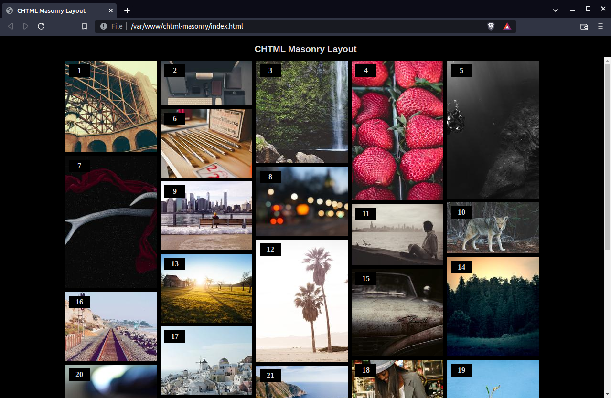

# chtml-masonry

> A Computed HTML (CHTML) approach to the Masonry layout

### Gary Royal




## Features 

* Time to Interactive < 1 second
* Supports high-density displays
* Responsive from 200 to 2000 density-independent pixels (dip) per row
* No dependencies


## Quick Start

1. Clone or download the repo
2. Open the chtml-masonry folder
3. Drop the file masonry.html into your browser window


## Overview

**Computed HTML** (CHTML) is a programming model in which the tags describing a complex layout are compiled in RAM, then passed to the browser's HTML interpreter to render in a single paint. 

**The Masonry layout** (also known as the Pinterest layout) is a matrix of semi-regular elements separated by a constant margin, like bricks in a wall, but rotated 90 degrees so that it grows from the top down as new elements are added.


## Strategy

CSS solutions to the masonry layout are fast, but they're fragile and unintuitive. Conventional JS solutions are slow, because they manipulate the nodes of an already-rendered DOM in situ. 

Next to CSS, Computed HTML is the next-fastest layout strategy because (a) the browser's HTML interpreter is optimized for rendering DOMs from streams of layout tags, and (b) the attributes of every tag are known or computed in advance, therefore (c) the renderer will never have to backtrack or repaint. 


### High Definition Displays

Thumbnail images are fetched at a multiple of the device pixel ratio if their native width and height are large enough. This will show the sharpest rendition on all displays at all times. 

Whether high-resolution thumbnails are worth their download bandwidth on devices with a pixel ratio > 2 is philosophical. For mobile devices, such densities are the result of Google's failure to define a display standard comparable to Apple's Retina. Google provisions bitmap assets up to 3x for Android even if some devices have a device pixel ratio greater than that.

These listings demonstrate the Computed HTML model by using it as a runtime for the Masonry layout algorithm under development. 


## Algorithm

```
const margin (px)
calc columns per row
calc column width
let img width = (column width - margin)

let column height[0 .. columns per row] = margin

for each image i

	let j = i mod (columns per row)
		
	left = offset of jth column
	top = column height[j]
	img height = (aspect ratio * img width)
	quality = (images[i][width] >= devicePixelRatio * img_width) ? devicePixelRatio : 1
	
	html[i] = '<div class=brick style="
		left:(left)px; 
		top:(top)px; 
		width:(quality * img width)px; 
		height:(quality * img height)px; 
		url(https://picsum.photos/seed/i/img_width/img_height)
	"></div>'

	let column height[j] += img height + margin
	
next image

gallery.innerHTML = array to string (chtml)
```

## Lorem Picsum 

**[Lorem Picsum](https://picsum.photos/)** is a placeholder service, an API for fetching arbitrary pictures with arbitrary dimensions for demonstration purposes.

It would not be practical to distribute an image database to demonstrate this Masonry algorithm. However, the native aspect ratio of Picsum placeholders is very regular; if scaled to their original aspect ratio, the rendered matrix would look like a grid instead of a brick wall, and it wouldn't be obvious how the algorithm works.

The file `image-sizes.js` contains a list of the width and height of 128 random pictures from my own database. We scale those dimensions to thumbnail size per the algorithm, then request a placeholder image from Picsum in place of the original database image.

Picsum placeholders are fetched in 'seed' mode, that is, for an arbitrary seed value, Picsum returns an arbitrary placeholder, subject to the constraint that the same seed value will always return the same image.

## Working On

 * Making the algorithm reentrant and implementing pagination / infinite scroll.
 
## Errata

Differences in average height per image per column often results in long runs of elements in some columns but not others. 

I left them as-is because the solution requires a second compute pass to balance the columns by inserting spacers or rearranging pictures, but I haven't chosen a strategy. 


## Exhibit 1 : Anatomy of a CHTML page

```
<?php

	// jsvars can contain any executable javascript, but it's typically used
	// to pass JSON-formatted query results from a database. 

	$jsvars="var greetings='Hello World';";
?>
<!DOCTYPE html>
<html lang="en-US">

<head>    
	<meta charset="utf-8">
	<meta name="viewport" content="width=device-width,initial-scale=1">
	<title>Computed HTML</title>
	<link href="library_styles.css" rel="stylesheet">
	<style>
		# local styles
	</style>
</head>

<body>
    <noscript>This page requires JavaScript.</noscript>

    <script><?php print($jsvars);?></script>
    
    <script src="library_script.js"></script>
    
    <!-- local script -->
    
    <script>

	document.addEventListener("DOMContentLoaded", function(){

		document.getElementById("gallery").innerHTML= [
	   		'<h1>', greetings, '</h1>', '<hr>', 
	   	].join('');
	});
    
    </script>
    
    <div id="gallery"></div>
</body>

</html>
```

